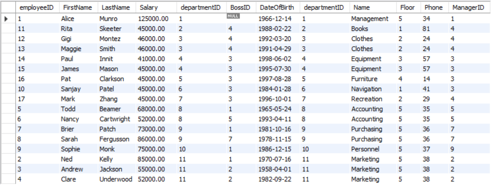

# 1. Formatting & Rounding

```sql
Select AVG(salary) AS Avg_Salary
From Employee;
```
```shell
60529.411765
```

format(X,D)
```sql
Select format(AVG(Salary),2) AS Avg_Salary
From Employee;
```
```shell
60,529.41   // a String
```


round(X,D)
```sql
Select round(AVG(Salary),2) AS Avg_Salary
From Employee;
```

```shell
60529.41    // a number
```


# 2. Joins

**只能join直接相连的relation (table)**


## 2.1 Natural Join
不推荐使用, 比inner join慢, 没有inner join严格


## 2.2 :full_moon:Inner Join

```sql
Select *
From department Inner Join employee
On department.departmentid = employee.departmentid;
```

Results:
左边是department table, 右边是对应的employee table


```sql
Select *
From employee Inner Join department
On employee.departmentid = department.departmentid;
```

Results:
左边是employee table, 右边是对应的department table




```sql
Select name, firstname, lastname
From department Inner Join employee
On department.departmentid = employee.departmentid;
```

Results:


```sql
# show each Employee full name and the department name they are working in
Select name AS Department_name, concat(firstname, ' ', lastname) AS Employee_name
From department Inner Join employee
On department.departmentid = employee.departmentid
Order by name;
```

Results:


### 2.2.1 Practice

```sql
# list the firstname and last name of all the employees in the Management department
Select firstname, lastname
From department Inner Join employee
On department.departmentid = employee.departmentid
Where name = 'Management';
```


```sql
# list the supplier name and the number of deliveries made to the department store
Select supplier.name AS supplier_name, count(deliveryid)
From supplier inner join delivery
On delivery.SupplierID  = supplier.SupplierID
Group by supplier_name
Order by supplier_name;
```

# 3. Sub Queries 

1.
```sql
# find the department that gives lowest salary
# first find out the lowest salary (sub-query)
# then find the department row that matches the lowest salary (outer query)
Select departmentid 
From employee
where salary = 
    (select min(salary)
    From employee);
```

```sql
# alternative to find the department that gives lowest salary
select departmentid, salary 
from employee
order by salary
limit 1;
```

```sql
# this is not right to find out the department giving lowest salary!
select min(salary), departmentid
from employee;
```


2.

if the sub-query returns more than 1 result, "=" will not work you have to use "IN" instead.

```sql
# how many employees work in departments located on the fifth 
floor
# firstly to know which departments on the fifth floor (sub-query)
# then find matching rows in employee (outer-query)
Select count(employeeid)
From employee
where departmentID In 
    (select departmentid
    From department
    where floor = 5
    );
```

```sql
# alternative way: use inner join
Select count(employeeid)
From employee inner join department
on employee.departmentid = department.departmentid
where department.floor = 5;
```

# 4. Multiple table joins

When we join more than 2 tables, the same principle apply, there must be a common column between the two entities functioning as a primary key/ foreign key referential integrity


1. Query: find the sale dates of all types of tents

We want to join item, saleitem, sale these three tables(they are directly connected):

```sql
# find the sale dates of all types of tents
Select *
From item inner join saleitem
on item.itemid = saleitem.itemid inner join sale
on saleitem.saleid = sale.saleid
where item.name LIKE "tent%";
```
Results:


```sql
# find the sale dates of all types of tents
Select item.name as item_name, saledate, sum(saleitem.quantity)
From item inner join saleitem
on item.itemid = saleitem.itemid inner join sale
on saleitem.saleid = sale.saleid
where item.name LIKE "tent%"
Group by item_name;
```

Results:


```sql
# find the sale dates of all types of tents
Select item.name as item_name, saledate, sum(saleitem.quantity)
From item inner join saleitem
on item.itemid = saleitem.itemid inner join sale
on saleitem.saleid = sale.saleid
where item.name LIKE "tent%"
Group by item_name, saledate;       # group by two columns
```

Results:


# 5. Having clause

The HAVING clause acts like a WHERE  clause but it identifies groups meeting a criteria, rather than rows. 
**A HAVING clause usually follows a GROUP BY clause.**


# 6. Union