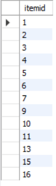
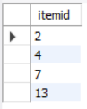
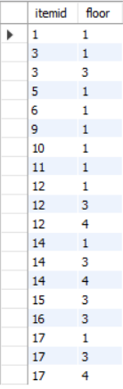
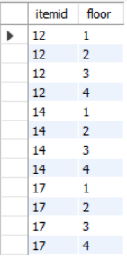
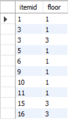

全部是practice

# e.g.1 

Type the query to list the id and name of all green items of type C

```sql
select itemid, name
From item
Where type = 'C' AND colour = 'Green';
```

# e.g.2

Type the query to find the items delivered by at least 2 suppliers (very similar to Having clause e.g.1 in week6)

```sql
Select item.name, count(distinct delivery.supplierid)
From item inner join deliveryitem inner join delivery
On item.itemid = deliveryitem.itemid AND deliveryitem.DeliveryId = delivery.DeliveryID
Group by item.itemid
Having count(distinct delivery.supplierid) >=2;
```

# e.g.3

Find the name of the highest-paid employee in the Marketing department

```sql
Select employee.firstname, employee.lastname, employee.salary
From employee inner join department
On employee.departmentid = department.departmentid
Where department.name = 'Marketing'
Order by employee.salary Desc
Limit 1;
```

# e.g.4

Find the supplier id and supplier name that do not deliver compasses

```sql
Select supplier.SupplierID, supplier.name
From supplier
Where supplier.supplierid NOT In (
		select delivery.supplierid
		From item inner join deliveryitem inner join delivery 
		On item.itemid = deliveryitem.itemid AND deliveryitem.deliveryId = delivery.deliveryID 
		Where item.name Like 'compass%'
);
```

# e.g.5

Find, for each department that has sold items of type E. List the department name and the average salary of the employees.

```sql
Select department.name, Format(avg(employee.salary),2) AS average_salary
From department inner join employee
On department.departmentid = employee.departmentid
Where department.departmentid IN (
		Select sale.departmentid 
		From item inner join saleitem inner join sale
		On item.itemid = saleitem.itemid AND saleitem.saleid = sale.saleid
		Where item.type = 'E'
		)
Group by department.name;
```

# e.g.6

Find the total number of items (list the item and sale quantity) of type E sold by the departments on the second floor

```sql
select item.name, sum(saleitem.Quantity) AS total_quantity
From item inner join saleitem inner join sale inner join department
On item.itemid = saleitem.itemId AND saleitem.SaleId = sale.SaleID AND  sale.departmentID = department.departmentID
Where department.floor = 2 AND item.type = 'E'
Group by item.name;
```

# e.g.7

Type the query to find the total quantity sold of each item by the department on the second floor 

similar to e.g.6

```sql
select item.name, sum(saleitem.Quantity) AS total_quantity
From item inner join saleitem inner join sale inner join department
On item.itemid = saleitem.itemId AND saleitem.SaleId = sale.SaleID AND  sale.departmentID = department.departmentID
Where department.floor = 2 
Group by item.name
Order by total_quantity Desc;
```

# :star: e.g.8

Find the items that are not sold by departments on the second floor but are sold on other floors within the store

## error demo1
> Note1: make sure you understand the question: "but are sold on other floors within the store" so that we want items being sold, not items no body want to buy. Therefore, you have to select saleitem.itemid, not item.itemid! 

```sql
# this is incorrect! because an item may not been sold by any departments! 
Select item.itemid
From item
Where item.itemid NOT IN (
		select item.itemid
		From item inner join saleitem inner join sale inner join department
		On item.itemid = saleitem.itemId AND saleitem.SaleId = sale.SaleID AND  sale.departmentID = department.departmentID
		Where department.floor = 2 
);
```
Results:



因为:

```sql
# items not been sold 
Select item.itemid 
From item
Where item.itemid NOT IN (
		select distinct saleitem.itemid
		From saleitem
);
```

Results:




## error demo2
> Note2: an item can be sold by multiple departments located on different floors. 

```sql
# this is incorrect!
Select distinct itemid, department.floor
From saleitem inner join sale inner join department
On saleitem.SaleId = sale.SaleID AND sale.departmentid = department.departmentID
Where department.floor != 2     # this is checked for each record (row) in the table
Order by saleitem.itemid;
```
Results:



因为:

```sql
Select distinct(item.itemid), department.floor
From item inner join saleitem inner join sale inner join department
On item.itemid = saleitem.itemid AND saleitem.SaleID = sale.saleid AND sale.departmentID = department.departmentID
Where saleitem.itemid IN (12,14,17)
Order by item.itemid, department.floor;
```

Results:



## solution
# correct solution
```sql
Select distinct saleitem.itemid, department.floor
From saleitem inner join sale inner join department
On saleitem.SaleId = sale.saleid AND sale.departmentid = department.departmentid
Where saleitem.itemid NOT IN (
		select item.itemid
		From item inner join saleitem inner join sale inner join department
		On item.itemid = saleitem.itemId AND saleitem.SaleId = sale.SaleID AND  sale.departmentID = department.departmentID
		Where department.floor = 2 
)
Order by saleitem.itemid;
```

Results:




## Summary
当题目中涉及到not..., 仔细审题, 以确保你理解题意.


# e.g.9

Find the numbers and names of the employees who earn more than their manager.