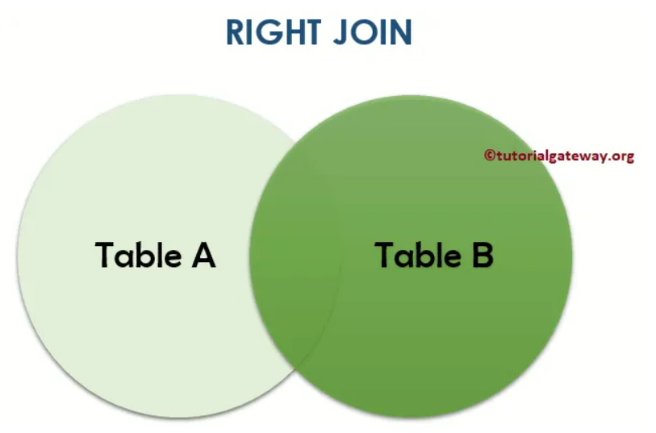

# 1. Outer join

To retrieve all items even if they have not been sold you may need to use an OUTER JOIN

MySQL server supports LEFT OUTER JOIN and RIGHT OUTER JOIN. Syntactically while RIGHT JOIN and LEFT JOIN work it is best to use the OUTER word to indicate your intent with the SQL statement.

YOu use a LEFT OUTER JOIN or a RIGHT OUTER JOIN dependent on where the 'Null' column table resides in your query.

## What is outer join



RIGHT OUTER JOIN returns matching rows in Table A, and all the records present in Table B.

In other word, RIGHT OUTER JOIN return results of A INNER JOIN B, plus the records that is left in Table B. Check below online material:

[MySQL-RIGHT-OUTER-JOIN-tutorial](https://www.tutorialgateway.org/mysql-right-join/)


## e.g.1

Find the number of units sold of each item

### error demo
```sql
SELECT item.name, count(item.itemID)
From item INNER JOIN saleitem
On item.itemID = saleitem.itemId
Group by item.name
Order by item.name, count(item.itemID) Desc;
```

### Solution
```sql
SELECT item.name, sum(saleitem.Quantity) AS unitSold
From item INNER JOIN saleitem
On item.itemID = saleitem.itemId
Group by item.name
Order by item.name, sum(item.itemID) Desc;
```

### Summary
一定看清楚是求什么, 是用sum()求某个column值的和, 还是用count()求记录的条数


## e.g.1.5

Based on e.g.1, look at below SQL:

辣鸡例子, 略 

## e.g.2

Find any suppliers that deliver no more than two unique items. List the suppliers in alphabetical order

```sql
Select supplier.Name, count(distinct deliveryitem.itemId)
From supplier inner join delivery inner join deliveryitem
On supplier.SupplierID = delivery.SupplierID AND delivery.DeliveryID = deliveryitem.DeliveryId
Group by supplier.name
Having count(distinct deliveryitem.itemId) <=2
Order by supplier.name;
```

:question: nothing to do with right outer join?

## e.g.3

Find the names of suppliers that have never delivered a compass

```sql
# solution
Select SupplierID, Name
From supplier
Where SupplierID NOT IN (
		Select delivery.SupplierID 
		From delivery inner join deliveryitem inner join item
		On delivery.DeliveryID = deliveryitem.DeliveryId AND deliveryitem.itemId = item.itemID
		Where item.name LIKE "compass%" 
);
```
:question: nothing to do with right outer join?

引申: find the supplier that have delivered a compass, and its number of delivering compass

```sql
Select delivery.SupplierID, count(delivery.SupplierID)
From delivery inner join deliveryitem inner join item
On delivery.DeliveryID = deliveryitem.DeliveryId AND deliveryitem.itemId = item.itemID
Where item.name LIKE "compass%" 
Group by delivery.SupplierID;
```

```sql
# check results
Select *
From delivery inner join deliveryitem inner join item
On delivery.DeliveryID = deliveryitem.DeliveryId AND deliveryitem.itemId = item.itemID
Where delivery.SupplierID = 101
Order by item.Name;
```

# 2. Unary joins

先略

## e.g.4


# 3. Views

先略

## e.g.7


# 4. Relational divides

## :star: e.g.14

List the departments that have at least one sale of all the items delivered to them.


## :star:e.g.15

Find the items (itemid) sold by ALL departments located on the second floor

### Solution1

#### Solution1 step1: 

show sale pair(itemid, departmentid)

```sql
select saleitem.itemId, department.departmentID
From saleitem inner join sale inner join department
On saleitem.SaleId = sale.SaleID AND sale.departmentID = department.departmentID
Where department.Floor = 2
Order by saleitem.itemId, department.departmentID;
```

#### :star: Solution1 step2: 

show distinct sale pair using group by two columns (yes, we can use GROUP BY based on 2 columns, in that case, the whole databased is divided based on the key(column1, column2) and then do the aggregate function)

```sql
select distinct saleitem.itemId, department.departmentID, count(saleitem.itemId)
From saleitem inner join sale inner join department
On saleitem.SaleId = sale.SaleID AND sale.departmentID = department.departmentID
Where department.Floor = 2
Group by saleitem.itemId, department.departmentID
Order by saleitem.itemId, department.departmentID;
```

##### :question: is there an easier way to display distinct sale pair?

Yes, there is: just place a distinct in front of saleitem.itemid based on step1

```sql
Select  distinct saleitem.itemId,  department.departmentID
From saleitem inner join sale inner join department
On sale.SaleID = saleitem.SaleId AND sale.departmentID = department.departmentID
Where department.Floor = 2
Order by saleitem.itemId, department.departmentID;
```

:question: difference between distinct itemid, distinct(itemid)

I think they are the same.

#### Solution1 final: 

Count distinct sale pair

For the sake of simplicity, store step2 into a view
```sql
Create view salePair AS
select saleitem.itemId, department.departmentID, count(saleitem.itemId)
From saleitem inner join sale inner join department
On saleitem.SaleId = sale.SaleID AND sale.departmentID = department.departmentID
Where department.Floor = 2
Group by saleitem.itemId, department.departmentID
Order by saleitem.itemId, department.departmentID;
```

now that just need to check if number of distinct sale pair equals department number on 2nd floor
```sql
Select itemid, count(itemid)
From salePair
Group by itemid
Having count(itemid) = (
        Select count(departmentID)
        From department
        Where department.Floor = 2
);
```

### Solution2

## e.g.16

List the department names that have not recorded a sale for all the items of type N


## e.g.17

Type a relational divide query that lists the suppliers that delivery only items sold by Books department